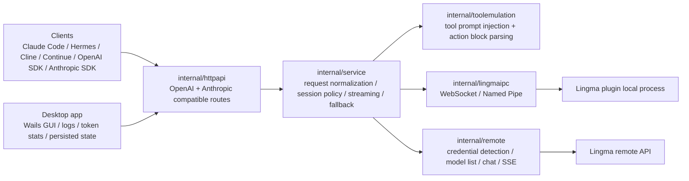
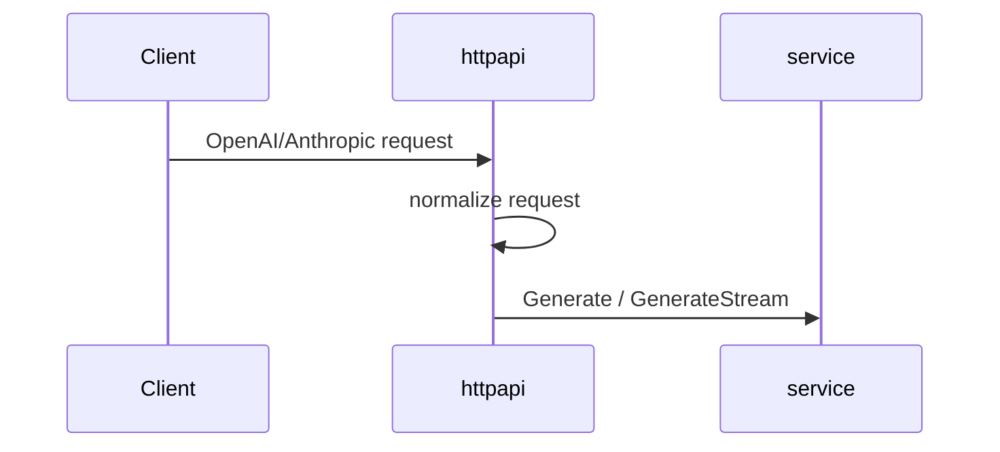
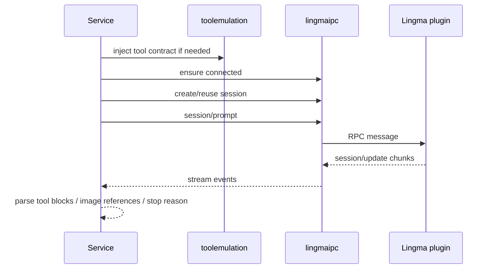
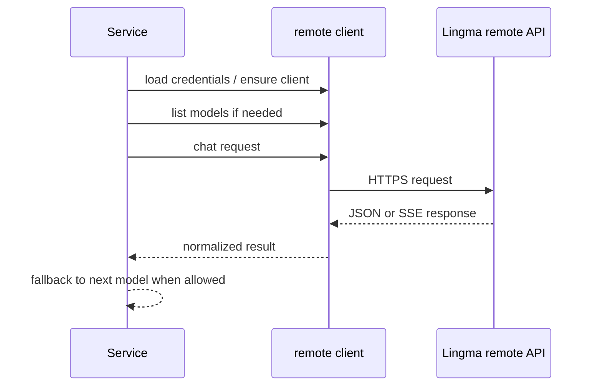

# Lingma Proxy Architecture

This document describes the current architecture of **Lingma Proxy**, including both backend modes:

- `remote`: the default and recommended mode, calling Lingma remote HTTP APIs directly with detected credentials
- `ipc`: a compatibility mode that bridges to the local Lingma IDE plugin transport

---

## 1. System Overview

---

## 2. Runtime Modes

### 2.1 Remote API mode

`backend=remote`

- Reads Lingma remote base URL from config, environment, or detected local Lingma logs
- Loads credentials from:
  - explicit `remote_auth_file`
  - or detected Lingma login cache
- Calls remote model list and chat endpoints directly
- Supports timeout / 429 / 5xx fallback across available remote models
- Does not use local plugin session environment knobs
- Avoids IDE/plugin IPC session lifetime, working directory, and extension environment limitations

### 2.2 IPC plugin mode

`backend=ipc`

- Reads local plugin transport information
- Connects through:
  - WebSocket on macOS / Linux
  - Named Pipe on Windows
- Reuses Lingma plugin session semantics
- Session/environment options in the desktop UI apply only here
- This mode is based on the IPC protocol insight from `coolxll/lingma-ipc-proxy`

---

## 3. Module Responsibilities

### 3.1 `cmd/lingma-ipc-proxy`

Entry point and config loading.

Responsibilities:

- parse CLI flags
- merge config file + environment + flags
- choose backend mode
- build `service.Config`
- start `internal/httpapi.Server`

Important config fields:

- `backend`
- `transport`
- `websocket_url`
- `pipe`
- `remote_base_url`
- `remote_auth_file`
- `remote_version`
- `remote_fallback_enabled`
- `remote_fallback_models`

### 3.2 `internal/httpapi`

Compatibility layer for OpenAI and Anthropic style APIs.

Primary routes:

- `GET /v1/models`
- `POST /v1/chat/completions`
- `POST /v1/messages`
- `GET /health`
- `GET /props`

Responsibilities:

- normalize OpenAI / Anthropic requests into `service.ChatRequest`
- convert service results back to OpenAI / Anthropic payloads
- stream SSE responses
- sanitize and record request / response payloads for debug UI

### 3.3 `internal/service`

Core orchestration layer.

Responsibilities:

- choose active backend
- warm up backend connection / credentials
- list models
- generate non-streaming responses
- generate streaming responses
- apply session reuse policy in IPC mode
- inject / parse tool emulation
- normalize image inputs
- apply remote fallback order

Important behavior split:

- IPC path uses `internal/lingmaipc`
- Remote path uses `internal/remote`

### 3.4 `internal/lingmaipc`

Local transport client for Lingma plugin IPC.

Responsibilities:

- detect WebSocket / pipe endpoint
- dial and reconnect
- send RPC messages such as:
  - `session/new`
  - `session/prompt`
  - `session/set_model`
  - `chat/deleteSessionById`
- consume `session/update` notifications

### 3.5 `internal/remote`

Remote HTTP client for Lingma cloud APIs.

Responsibilities:

- resolve base URL
- load and validate credentials
- derive machine / user identity for remote auth
- list remote models
- call remote chat endpoint
- handle remote SSE streaming

### 3.6 `internal/toolemulation`

Prompt-based tool bridge for models that do not expose native tool calling in Lingma transport.

Responsibilities:

- extract tool definitions from OpenAI / Anthropic requests
- append tool contract to prompt
- parse JSON action blocks from model output
- project tool calls back to:
  - Anthropic `tool_use`
  - OpenAI `tool_calls`

---

## 4. Request Flow

### 4.1 Shared ingress flow

### 4.2 IPC backend flow

### 4.3 Remote backend flow

---

## 5. Remote Fallback Strategy

Remote fallback is used only when all conditions are true:

- `backend=remote`
- `remote_fallback_enabled=true`
- request has not emitted stream output yet
- upstream error matches timeout / 429 / 5xx class

Current default order:

1. `kmodel`
2. `mmodel`
3. `dashscope_qwen3_coder`
4. `dashscope_qmodel`
5. `dashscope_qwen_max_latest`
6. `dashscope_qwen_plus_20250428_thinking`

Before using that order, the service filters candidates against the actual `/v1/models` result from the remote backend so unavailable models are skipped.

---

## 6. Desktop App Architecture

The Wails desktop app is a management UI around the local proxy process.

Responsibilities:

- start / stop / restart proxy
- show current backend and resolved endpoints
- persist:
  - request history
  - logs
  - token statistics
- show detected IPC and remote credentials metadata
- edit config and restart proxy on save

Persisted local state:

- config: `~/.config/lingma-proxy/config.json`
- legacy config fallback: `~/.config/lingma-ipc-proxy/config.json`
- UI/runtime state: `~/.config/lingma-ipc-proxy/app-state.json`

Production packaging rules:

- packaged app should not auto-open inspector
- local development can opt in with `LINGMA_DESKTOP_DEBUG=1`

---

## 7. Key Design Decisions

### 7.1 Why keep both IPC and remote modes?

Because the two modes solve different problems:

- Remote mode avoids plugin runtime coupling and is usually better for third-party agent clients.
- IPC mode preserves plugin session semantics and remains useful when the caller specifically wants the local plugin's context or model list.

### 7.2 Why keep tool emulation even with remote mode?

Because Lingma-exposed models are not guaranteed to speak OpenAI/Anthropic native tool protocol consistently across all routes. The proxy must keep a stable external contract even when the upstream model capability is uneven.

### 7.3 Why persist requests and token stats in the desktop app?

Because the GUI is used as an operational console, not a transient preview. Users need model usage, logs, and recent traffic to survive app restarts.

---

## 8. Known Boundaries

- IPC mode still has stronger environment coupling with the local Lingma plugin
- remote credential detection depends on local Lingma cache / auth file layout
- image payloads are sanitized in persisted request logs to avoid oversized local state
- request history may contain mixed models in remote mode when fallback is triggered or when different clients specify different models

---

## 9. Files to Read First

If you are extending the system, start here:

- `cmd/lingma-ipc-proxy/main.go`
- `internal/httpapi/server.go`
- `internal/service/service.go`
- `internal/lingmaipc/*`
- `internal/remote/*`
- `desktop/app.go`
- `desktop/main.go`

---

Document version: 2026-05-06
