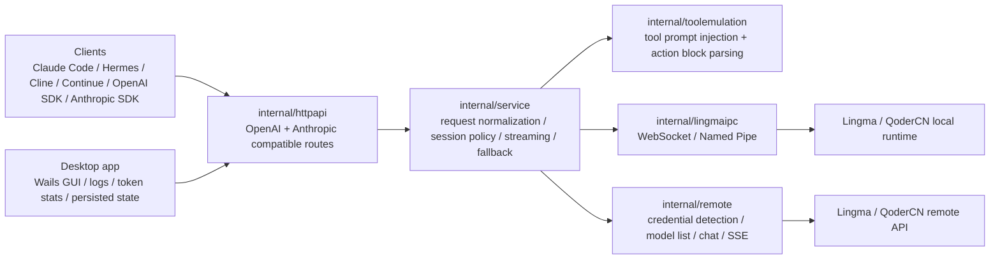
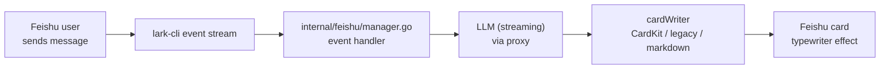
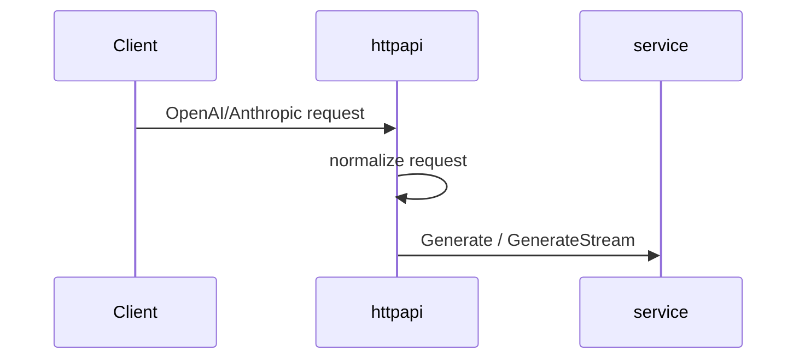
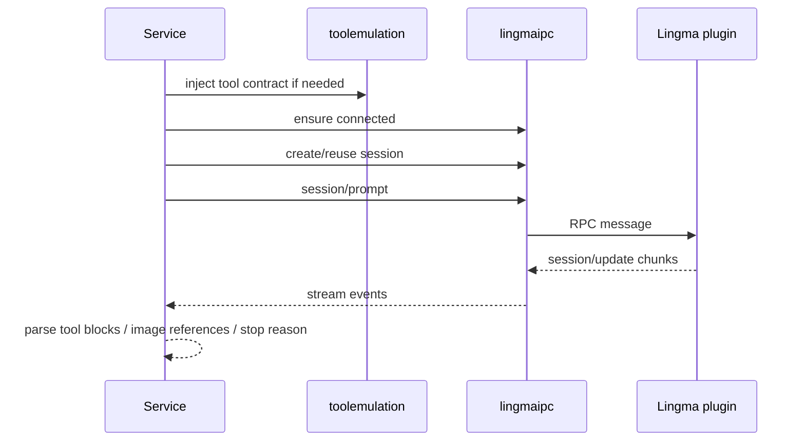
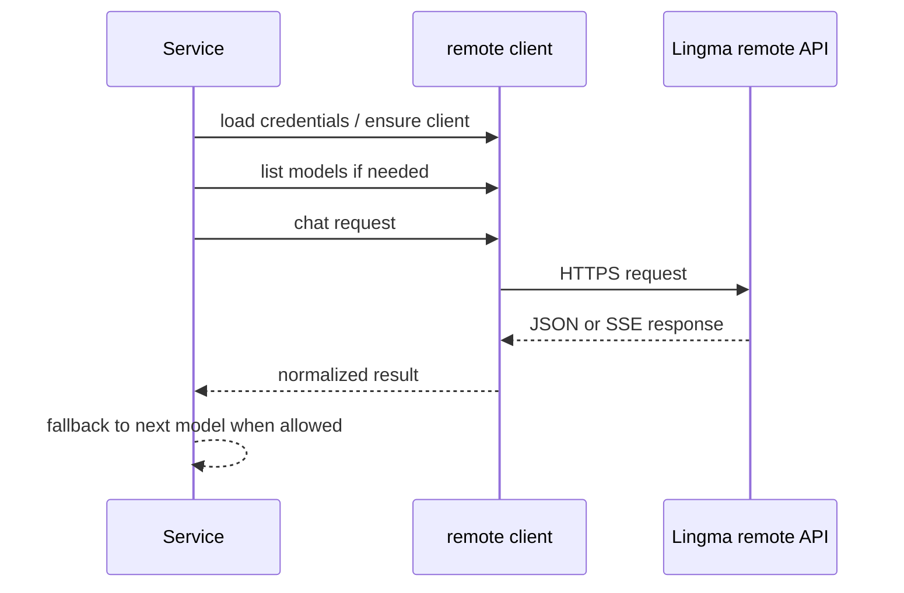

# Lingma Proxy Architecture

This document describes the current architecture of **Lingma Proxy**, including both backend modes:

- `remote`: the default and recommended mode, calling Lingma / QoderCN remote HTTP APIs directly with detected credentials
- `ipc`: a compatibility mode that bridges to the local Lingma / QoderCN runtime transport

---

## 1. System Overview

```mermaid
flowchart LR
    A["Clients<br/>Claude Code / Hermes / Cline / Continue / OpenAI SDK / Anthropic SDK"]
    B["internal/httpapi<br/>OpenAI + Anthropic compatible routes"]
    C["internal/service<br/>request normalization / session policy / streaming / fallback"]
    D["internal/toolemulation<br/>tool prompt injection + action block parsing"]
    E["internal/lingmaipc<br/>WebSocket / Named Pipe"]
    F["internal/remote<br/>credential detection / model list / chat / SSE"]
    G["Lingma / QoderCN local runtime"]
    H["Lingma / QoderCN remote API"]
    I["Desktop app<br/>Wails GUI / logs / token stats / persisted state"]

    A --> B
    I --> B
    B --> C
    C --> D
    C --> E
    C --> F
    E --> G
    F --> H
```

---

## 1.5 Feishu Agent

An optional subsystem that connects the proxy to Feishu (Lark) as a bot, enabling chat-based AI interactions with streaming card output.

```mermaid
flowchart LR
    A["Feishu user<br/>sends message"] --> B["lark-cli event stream"]
    B --> C["internal/feishu/manager.go<br/>event handler"]
    C --> D["LLM (streaming)<br/>via proxy"]
    D --> E["cardWriter<br/>CardKit / legacy / markdown"]
    E --> F["Feishu card<br/>typewriter effect"]
```

Key components:

| Module | Responsibility |
|--------|---------------|
| `internal/feishu/manager.go` | Event handling, conversation state, LLM orchestration, lark-cli subprocess management |
| `internal/feishu/card.go` | CardKit schema 2.0 streaming cards, legacy schema 1.0 fallback, cardWriter state machine |
| `internal/feishu/llm.go` | Streaming and non-streaming LLM calls via proxy SSE |
| `internal/feishu/tools.go` | lark-cli tool definitions and execution (IM, Drive, Calendar, etc.) |
| `internal/feishu/prompt.go` | System prompt construction, skill excerpt injection, tool-use decision logic |
| `internal/feishu/skills.go` | Skill discovery (disk scan + lock file) |
| `internal/feishu/config.go` | Feishu Agent configuration model |
| `internal/feishu/install.go` | lark-cli and Skills installation |
| `internal/feishu/onboarding.go` | lark-cli init and auth flow |
| `internal/feishu/env.go` | PATH resolution for lark-cli / Node / npm |

Card streaming architecture (3-tier graceful degradation):

1. **CardKit streaming** (schema 2.0, `streaming_mode: true`): Element-level `PUT` with typewriter effect at 70ms/char
2. **Legacy PATCH** (schema 1.0, `PATCH /im/v1/messages/:id`): Whole-card refresh every ~300ms
3. **Plain markdown** (`lark-cli im +messages-reply --markdown`): Last resort fallback

CardKit sequence management: All API calls to the same card must use a strictly increasing `sequence` integer (1–2147483647), otherwise error 300317 is returned.

CardKit final-state layering:

- the initial streaming card creates stable `subtitle_md`, `steps_md`, `reply_md`, and `hint_md` elements; normal text deltas only update `reply_md`
- when a tool step finishes, the card performs a small structural refresh that inserts completed tools as collapsed `collapsible_panel` blocks while keeping `reply_md` available for later text streaming
- on normal completion, the Agent first disables `/settings.streaming_mode`, then performs a small final card update so the header/status does not remain in the thinking state
- long replies or large tool payloads use a compact final card plus chunked markdown; the compact card still keeps recent collapsed tool summaries with bounded count and body size

Authorization and permissions: the model must not run `lark-cli auth login` directly. When tool output reports `need_user_authorization` or missing scopes, the Agent owns the device-flow login, replies with the authorization URL, and waits for the user to authorize before continuing.

Local File Access: safe file tools (`safe_file_read`, `safe_file_write`, `safe_file_list`, `safe_file_delete`) are gated by the Feishu Agent advanced settings. By default, only the app-managed workspace is writable. Other local paths must be explicitly configured as `read`, `write`, or `delete`. Chat-based `授权目录 /path` or `授权文件 /path` authorization only adds a read-only allowlist entry under the app config directory; it never grants write or delete permission.

Write/Delete Safeguards: overwriting an existing file requires the latest user message to explicitly contain `确认覆盖 <filename or absolute path>`. Deleting files requires both `confirmed: true` and an exact `确认删除 <filename or absolute path>` in the latest user message. Directory deletion is blocked. Path checks resolve real paths and use proper subpath matching to avoid prefix and symlink escapes.

---

## 2. Runtime Modes

### 2.1 Remote API mode

`backend=remote`

- Reads Lingma / QoderCN remote base URL from config, environment, or detected local runtime logs
- Loads credentials from:
  - explicit `remote_auth_file`
  - or detected Lingma / QoderCN login cache
- Calls remote model list and chat endpoints directly
- Supports timeout / 429 / 5xx fallback across available remote models
- Does not use local plugin session environment knobs
- Avoids IDE/plugin IPC session lifetime, working directory, and extension environment limitations

### 2.2 IPC plugin mode

`backend=ipc`

- Reads local runtime transport information
- Connects through:
  - WebSocket on macOS / Linux
  - Named Pipe on Windows
- Reuses Lingma / QoderCN session semantics
- Session/environment options in the desktop UI apply only here
- This mode is based on the IPC protocol insight from `coolxll/lingma-ipc-proxy`

Validated runtime behavior:

Full IPC generation requires a runtime that exposes the session creation RPCs used by the proxy. In practice, keep the QoderCN desktop app or a supported Tongyi Lingma desktop / legacy Lingma runtime running. The VS Code extension alone is only a partial discovery/runtime surface.

| Runtime | IPC status |
| --- | --- |
| QoderCN desktop app only | Full endpoint matrix passed on macOS WebSocket. |
| QoderCN desktop app plus `alibaba-cloud.tongyi-lingma` VS Code extension | Full endpoint matrix passed; auto-detection prefers QoderCN. |
| JetBrains Tongyi Lingma plugin in IntelliJ IDEA | Full endpoint matrix passed on macOS WebSocket using `~/.lingma`. |
| Tongyi Lingma / legacy Lingma runtime | Supported as fallback. |
| `alibaba-cloud.tongyi-lingma` VS Code extension only | Partial only: model discovery works, but full generation fails because this runtime does not support the `session/new` RPC. |
| Windows QoderCN | Not yet verified on a Windows machine or VM. |

---

## 3. Module Responsibilities

### 3.1 `cmd/lingma-ipc-proxy`

Entry point and config loading.

Responsibilities:

- parse CLI flags
- merge config file + environment + flags
- choose backend mode
- build `service.Config`
- start `internal/httpapi.Server`

Important config fields:

- `backend`
- `transport`
- `websocket_url`
- `pipe`
- `remote_base_url`
- `remote_auth_file`
- `remote_version`
- `remote_fallback_enabled`
- `remote_fallback_models`

### 3.2 `internal/httpapi`

Compatibility layer for OpenAI and Anthropic style APIs.

Primary routes:

- `GET /v1/models`
- `POST /v1/chat/completions`
- `POST /v1/messages`
- `GET /health`
- `GET /props`

Responsibilities:

- normalize OpenAI / Anthropic requests into `service.ChatRequest`
- convert service results back to OpenAI / Anthropic payloads
- stream SSE responses
- sanitize and record request / response payloads for debug UI

### 3.3 `internal/service`

Core orchestration layer.

Responsibilities:

- choose active backend
- warm up backend connection / credentials
- list models
- generate non-streaming responses
- generate streaming responses
- apply session reuse policy in IPC mode
- inject / parse tool emulation
- normalize image inputs
- apply remote fallback order

Important behavior split:

- IPC path uses `internal/lingmaipc`
- Remote path uses `internal/remote`

### 3.4 `internal/lingmaipc`

Local transport client for Lingma / QoderCN IPC.

Responsibilities:

- detect WebSocket / pipe endpoint, preferring QoderCN runtime files before Lingma runtime files
- provide the runtime-specific IPC image URI scheme (`qodercn:///...` for QoderCN, `lingma:///...` for legacy Lingma)
- dial and reconnect
- send RPC messages such as:
  - `session/new`
  - `session/prompt`
  - `session/set_model`
  - `chat/deleteSessionById`
- consume `session/update` notifications

### 3.5 `internal/remote`

Remote HTTP client for Lingma / QoderCN cloud APIs.

Responsibilities:

- resolve base URL
- load and validate credentials
- derive machine / user identity for remote auth
- list remote models
- call remote chat endpoint
- handle remote SSE streaming

### 3.6 `internal/toolemulation`

Prompt-based tool bridge for models that do not expose native tool calling in Lingma transport.

Responsibilities:

- extract tool definitions from OpenAI / Anthropic requests
- append tool contract to prompt
- parse JSON action blocks from model output
- project tool calls back to:
  - Anthropic `tool_use`
  - OpenAI `tool_calls`

---

## 4. Request Flow

### 4.1 Shared ingress flow

```mermaid
sequenceDiagram
    participant Client
    participant HTTP as httpapi
    participant Service as service

    Client->>HTTP: OpenAI/Anthropic request
    HTTP->>HTTP: normalize request
    HTTP->>Service: Generate / GenerateStream
```

### 4.2 IPC backend flow

```mermaid
sequenceDiagram
    participant Service
    participant Tool as toolemulation
    participant IPC as lingmaipc
    participant Plugin as Lingma plugin

    Service->>Tool: inject tool contract if needed
    Service->>IPC: ensure connected
    Service->>IPC: create/reuse session
    Service->>IPC: session/prompt
    IPC->>Plugin: RPC message
    Plugin-->>IPC: session/update chunks
    IPC-->>Service: stream events
    Service-->>Service: parse tool blocks / image references / stop reason
```

### 4.3 Remote backend flow

```mermaid
sequenceDiagram
    participant Service
    participant Remote as remote client
    participant API as Lingma remote API

    Service->>Remote: load credentials / ensure client
    Service->>Remote: list models if needed
    Service->>Remote: chat request
    Remote->>API: HTTPS request
    API-->>Remote: JSON or SSE response
    Remote-->>Service: normalized result
    Service-->>Service: fallback to next model when allowed
```

---

## 5. Remote Fallback Strategy

Remote fallback is used only when all conditions are true:

- `backend=remote`
- `remote_fallback_enabled=true`
- request has not emitted stream output yet
- upstream error matches timeout / 429 / 5xx class

Current default order:

1. `kmodel`
2. `mmodel`
3. `dashscope_qwen3_coder`
4. `dashscope_qmodel`
5. `dashscope_qwen_max_latest`
6. `dashscope_qwen_plus_20250428_thinking`

Before using that order, the service filters candidates against the actual `/v1/models` result from the remote backend so unavailable models are skipped.

---

## 6. Desktop App Architecture

The Wails desktop app is a management UI around the local proxy process.

Responsibilities:

- start / stop / restart proxy
- show current backend and resolved endpoints
- persist:
  - request history
  - logs (with `createdAt`, plus short-window fingerprint dedupe)
  - token statistics
- show detected IPC and remote credentials metadata
- edit config and restart proxy on save

Persisted local state:

- config: `~/.config/lingma-proxy/config.json`
- legacy config fallback: `~/.config/lingma-ipc-proxy/config.json`
- UI/runtime state: `~/.config/lingma-ipc-proxy/app-state.json`

Feedback bundle export:

- default export includes `app-logs.json`, `request-logs.json`, config summary, environment summary, and detection info
- when Feishu Agent is available, the bundle also includes `feishu-agent-status.json`
- `app-logs.json` preserves Feishu Agent `source/sessionId/chatId/messageId/level/message` fields with text redaction
- the UI log list displays `today/yesterday/MM-DD + time` from `createdAt`; old logs without `createdAt` fall back to `time`

Production packaging rules:

- desktop packages keep Wails DevTools enabled so the right-click default context menu can open `Inspect Element`
- packaged apps should not auto-open inspector by default
- launch with `LINGMA_DESKTOP_DEBUG=1` only when the inspector should open immediately on startup
- local-only rebuilds may opt out with `ENABLE_DEVTOOLS=0 ./scripts/rebuild-local-app.sh`

---

## 7. Key Design Decisions

### 7.1 Why keep both IPC and remote modes?

Because the two modes solve different problems:

- Remote mode avoids plugin runtime coupling and is usually better for third-party agent clients.
- IPC mode preserves plugin session semantics and remains useful when the caller specifically wants the local plugin's context or model list.

### 7.2 Why keep tool emulation even with remote mode?

Because Lingma-exposed models are not guaranteed to speak OpenAI/Anthropic native tool protocol consistently across all routes. The proxy must keep a stable external contract even when the upstream model capability is uneven.

### 7.3 Why persist requests and token stats in the desktop app?

Because the GUI is used as an operational console, not a transient preview. Users need model usage, logs, and recent traffic to survive app restarts.

---

## 8. MCP Client

The Feishu Agent includes a full MCP (Model Context Protocol 2025-06-18) client that connects to external MCP servers via stdio transport. All three capability domains are supported:

| Domain | Operations | Exposure to LLM |
|--------|-----------|-----------------|
| **Tools** | `tools/list`, `tools/call` | Direct function calling via `mcp_call` |
| **Resources** | `resources/list`, `resources/templates/list`, `resources/read` | `mcp_resource_read` pseudo-tool + system prompt listing |
| **Prompts** | `prompts/list`, `prompts/get` | `mcp_prompt_get` pseudo-tool + system prompt listing |

MCP servers are configured in `config.toml` under `[mcp_servers]` or via JSON config. The client negotiates capabilities during `initialize`, fetches lists in `Sync()`, and routes notifications (`notifications/tools/list_changed`, `notifications/resources/list_changed`, `notifications/prompts/list_changed`) to trigger re-sync.

Key files: `internal/feishu/mcp.go` (client + runtime), `internal/feishu/status.go` (status structs).

---

## 9. Context Management

The Feishu Agent implements a 4-tier watermark system for context window management:

| Watermark | Threshold | Action |
|-----------|-----------|--------|
| `ok` | < 60% | No compaction |
| `microcompact` | 60–74% | Old tool results truncated to 200-char stubs, keep 3 recent |
| `compact` | 75–84% | LLM-powered structured summary + keep 2 tool results |
| `critical` | 85–91% | Force summary + minimal tool results |
| `blocking` | ≥ 92% | Reject request, prompt user to `/compact` |

**Tool result classification** (`classifyToolResult` in `context_budget.go`): Each tool result is categorized as `preserve` (keep full, e.g. doc/sheet content chunks), `summarize` (structured extraction of key fields), `stub` (metadata only), or `discard` (placeholder). This replaces the previous one-size-fits-all 1200-char truncation.

**Tool memory** (`context_store.go`): All tool results are persisted to SQLite with FTS5 full-text search. The `fetch_tool_memory` tool allows the LLM to search or retrieve previous results by keyword or ID.

**Feishu history search** (`history_backfill.go`): The `feishu_history_search` tool calls `lark-cli im +messages-search` to search chat history beyond the context window, with SQLite caching (10-min TTL).

**Conversation compression** (`manager.go`): When triggered, the LLM compressor generates a structured JSON summary (`StructuredSummary`) preserving goals, decisions, pending actions, entities, and tool memory references. Compressed messages retain first/last 200 characters for context boundaries.

Key files: `internal/feishu/context_budget.go` (watermark + classification), `internal/feishu/context_store.go` (SQLite + FTS5), `internal/feishu/manager.go` (compaction pipeline).

---

## 10. Known Boundaries

- IPC mode still has stronger environment coupling with the local Lingma plugin
- remote credential detection depends on local Lingma cache / auth file layout
- image payloads are sanitized in persisted request logs to avoid oversized local state
- request history may contain mixed models in remote mode when fallback is triggered or when different clients specify different models

---

## 9. Files to Read First

If you are extending the system, start here:

- `cmd/lingma-ipc-proxy/main.go`
- `internal/httpapi/server.go`
- `internal/service/service.go`
- `internal/lingmaipc/*`
- `internal/remote/*`
- `internal/feishu/manager.go`
- `internal/feishu/card.go`
- `internal/feishu/prompt.go`
- `internal/feishu/mcp.go`
- `internal/feishu/context_budget.go`
- `internal/feishu/context_store.go`
- `desktop/app.go`
- `desktop/main.go`

---

Document version: 2026-05-28
