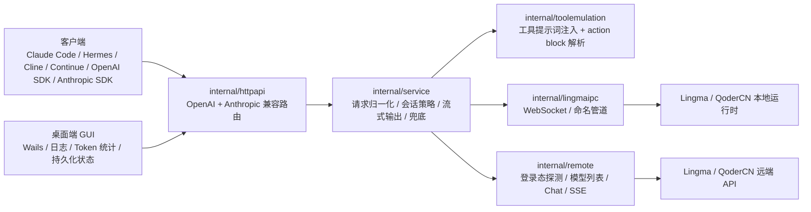
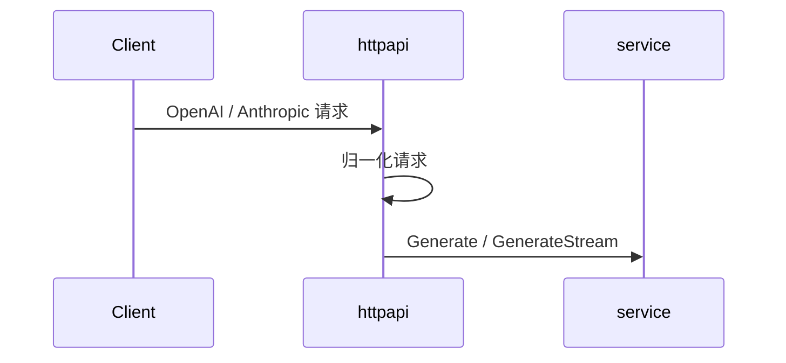
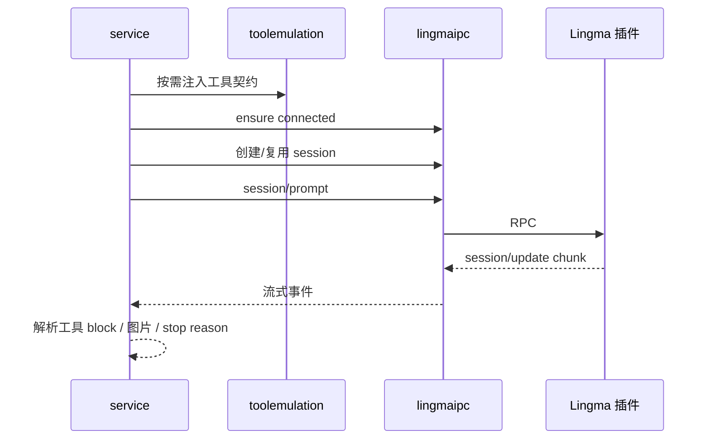
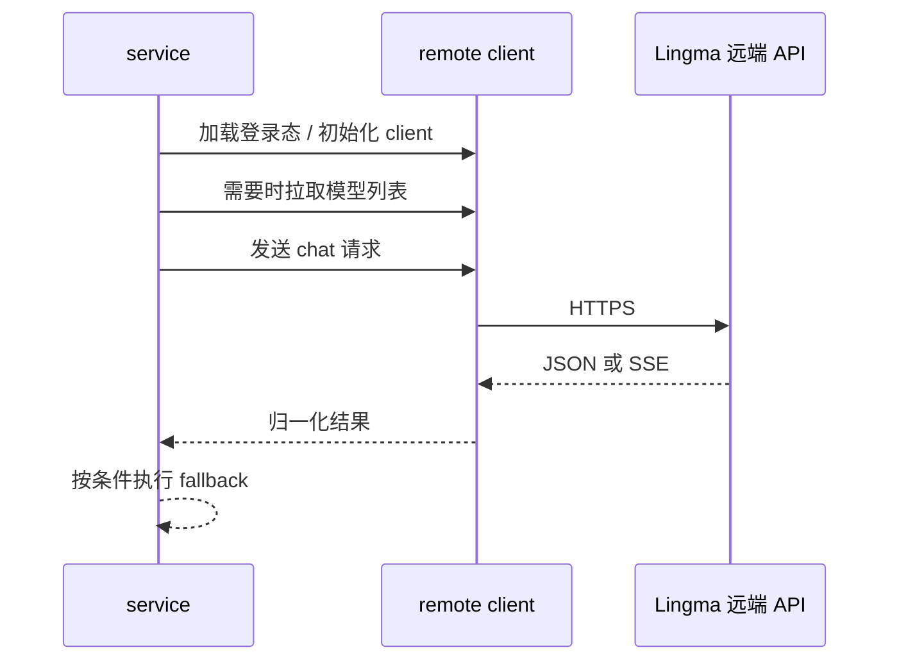

# Lingma Proxy 架构文档

本文档描述 **Lingma Proxy** 的当前架构，覆盖两种后端模式：

- `remote`：默认推荐模式，使用探测到的登录态直接调用 Lingma / QoderCN 远端 HTTP API
- `ipc`：兼容模式，桥接本地 Lingma / QoderCN 运行时传输层

---

## 1. 系统总览

---

## 2. 运行模式

### 2.1 Remote API 模式

`backend=remote`

- 从配置、环境变量或本地 Lingma / QoderCN 日志中解析远端域名
- 加载认证信息：
  - 显式指定的 `remote_auth_file`
  - 或自动探测 Lingma / QoderCN 登录缓存
- 直接请求远端模型列表和聊天接口
- 支持远端超时 / 429 / 5xx 的模型兜底切换
- 不依赖本地插件会话环境参数
- 避免 IDE / 插件 IPC 会话生命周期、工作目录和扩展环境限制

### 2.2 IPC 插件模式

`backend=ipc`

- 读取本地 Lingma / QoderCN 运行时传输信息
- 通过以下方式连接：
  - macOS / Linux：WebSocket
  - Windows：Named Pipe
- 复用 Lingma / QoderCN 运行时自身的 session 语义
- 桌面端里“会话与环境”相关配置只在这里生效
- 该模式基于 `coolxll/lingma-ipc-proxy` 的 IPC 协议发现思路

已验证运行时行为：

完整 IPC 生成能力要求本地运行时暴露代理所需的会话创建 RPC。实际使用时，至少保持 QoderCN 桌面 App，或受支持的通义灵码桌面 / 旧 Lingma 运行时处于开启状态；单独 VS Code 扩展只算部分发现/运行时能力。

| 运行环境 | IPC 状态 |
| --- | --- |
| 只运行 QoderCN 桌面 App | macOS WebSocket 全接口矩阵通过。 |
| QoderCN 桌面 App + `alibaba-cloud.tongyi-lingma` VS Code 扩展同时运行 | 全接口矩阵通过；自动探测优先 QoderCN。 |
| 通义灵码 / 旧 Lingma 运行时 | 作为 fallback 支持。 |
| 只运行 `alibaba-cloud.tongyi-lingma` VS Code 扩展 | 仅部分支持：模型发现可用，但该运行时不支持 `session/new` RPC，完整生成链路失败。 |
| Windows QoderCN | 尚未在 Windows 真机或 VM 验证。 |

---

## 3. 模块职责

### 3.1 `cmd/lingma-ipc-proxy`

入口与配置装配层。

职责：

- 解析命令行参数
- 合并配置文件 / 环境变量 / CLI flags
- 选择后端模式
- 构建 `service.Config`
- 启动 `internal/httpapi.Server`

关键配置字段：

- `backend`
- `transport`
- `websocket_url`
- `pipe`
- `remote_base_url`
- `remote_auth_file`
- `remote_version`
- `remote_fallback_enabled`
- `remote_fallback_models`

### 3.2 `internal/httpapi`

OpenAI / Anthropic 兼容层。

主要路由：

- `GET /v1/models`
- `POST /v1/chat/completions`
- `POST /v1/messages`
- `GET /health`
- `GET /props`

职责：

- 把 OpenAI / Anthropic 请求归一化为 `service.ChatRequest`
- 把 service 结果重新编码成 OpenAI / Anthropic 响应
- 输出 SSE 流
- 记录调试用请求 / 响应摘要

### 3.3 `internal/service`

核心编排层。

职责：

- 选择当前 backend
- backend 预热
- 拉取模型列表
- 非流式生成
- 流式生成
- IPC 模式下的 session 复用策略
- 工具模拟注入与解析
- 图片输入归一化
- 远端 fallback 顺序控制

分支逻辑：

- IPC 路径走 `internal/lingmaipc`
- Remote 路径走 `internal/remote`

### 3.4 `internal/lingmaipc`

本地 Lingma / QoderCN IPC 客户端。

职责：

- 自动探测 WebSocket / pipe 端点，优先使用 QoderCN 运行时文件，再回退 Lingma 运行时文件
- 建立连接与重连
- 发送 RPC：
  - `session/new`
  - `session/prompt`
  - `session/set_model`
  - `chat/deleteSessionById`
- 消费 `session/update` 通知

### 3.5 `internal/remote`

Lingma / QoderCN 远端 HTTP 客户端。

职责：

- 解析远端 base URL
- 加载并校验登录态
- 生成远端请求所需身份信息
- 获取远端模型列表
- 调用远端聊天接口
- 处理远端 SSE 流式响应

### 3.6 `internal/toolemulation`

工具调用模拟层。

职责：

- 从 OpenAI / Anthropic 请求中提取工具定义
- 将工具契约注入 prompt
- 从模型文本里解析 JSON action block
- 回投为：
  - Anthropic `tool_use`
  - OpenAI `tool_calls`

---

## 4. 请求主流程

### 4.1 通用入口

### 4.2 IPC 后端流程

### 4.3 Remote 后端流程

---

## 5. 远端兜底策略

仅在以下条件同时满足时启用：

- `backend=remote`
- `remote_fallback_enabled=true`
- 还没有向客户端输出任何流式 token
- 上游错误属于 timeout / 429 / 5xx

当前默认顺序：

1. `kmodel`
2. `mmodel`
3. `dashscope_qwen3_coder`
4. `dashscope_qmodel`
5. `dashscope_qwen_max_latest`
6. `dashscope_qwen_plus_20250428_thinking`

实际执行前，service 会先拿远端 `/v1/models` 的真实结果过滤一遍，只保留当前账号真的可用的模型。

---

## 6. 桌面端架构

Wails 桌面端不是简单预览壳，而是本地代理的运维控制台。

职责：

- 启动 / 停止 / 重启代理
- 展示当前 backend、监听地址、探测结果
- 持久化：
  - 请求历史
  - 日志
  - Token 统计
- 编辑配置并保存后按需重启

本地持久化路径：

- 配置：`~/.config/lingma-proxy/config.json`
- 旧配置兼容读取：`~/.config/lingma-ipc-proxy/config.json`
- GUI 运行状态：`~/.config/lingma-ipc-proxy/app-state.json`

打包要求：

- 生产包不自动打开 Inspector / 调试入口
- 本地开发可通过 `LINGMA_DESKTOP_DEBUG=1` 显式开启

---

## 7. 关键设计决策

### 7.1 为什么同时保留 IPC 和 Remote？

因为两种模式解决的问题不同：

- Remote 模式避免插件运行时耦合，通常更适合第三方 Agent 客户端。
- IPC 模式保留插件会话语义，适合明确需要本地插件上下文或插件模型列表的场景。

### 7.2 为什么 Remote 也保留 Tool Emulation？

因为 Lingma 暴露出来的模型能力并不保证始终稳定兼容 OpenAI / Anthropic 原生 tools 协议。代理层必须对外提供稳定契约，不能把上游模型差异直接泄露给客户端。

### 7.3 为什么桌面端要持久化请求和 Token？

因为这个 GUI 已经是运维面板，不是一次性调试页。重启后仍然需要保留最近请求、日志和 usage 统计，便于排障和观察模型表现。

---

## 8. 当前边界

- IPC 模式仍然受本地 Lingma 插件运行态影响
- Remote 登录态探测依赖本地 Lingma 缓存结构
- 图片类请求在本地持久化时会做裁剪/脱敏，避免状态文件过大
- Remote 模式下如果启用了 fallback，最近一次“聊天模型”可能与客户端最初指定模型不同

---

## 9. 代码入口建议

如果要继续扩展，优先看这些文件：

- `cmd/lingma-ipc-proxy/main.go`
- `internal/httpapi/server.go`
- `internal/service/service.go`
- `internal/lingmaipc/*`
- `internal/remote/*`
- `desktop/app.go`
- `desktop/main.go`

---

文档版本：2026-05-06
